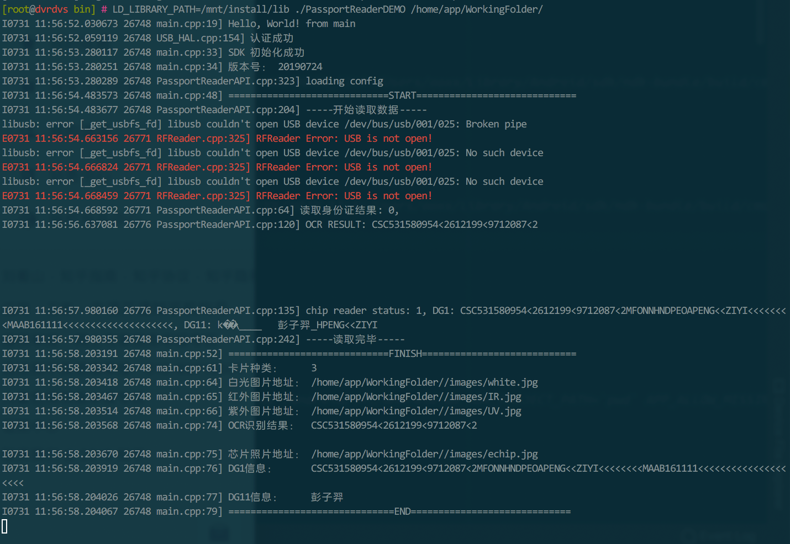

## 如何安装

1. （建议）将 ```include``` ```lib``` 目录复制到 ```/usr``` 中

2. （如果系统使用udev进行权限设置）将```rules.d```复制到```/etc/udev```中，或者使用其他方法确保应用程序对```/dev/bus/usb/```下相应设备文件具有足够的权限
3. 将sample目录拷贝至合适的位置


## 如何编译、运行Demo程序

Demo程序的源代码```sample```目录下，文件名为`demo.cpp`和`demo.c`，预编译好的二进制文件为`demo`

手动编译指令 （如果已经进行了上一节中的操作1，无需手动指定lib和include的路径）

CPP Demo:

```shell
/opt/hisi-linux/x86-arm/arm-himix200-linux/bin/arm-himix200-linux-gcc demo.cpp -o demo -O3 -ffast-math -ftree-vectorize -flto -mcpu=cortex-a7 -mfpu=neon-vfpv4 -mfloat-abi=softfp -fPIC \
-lPassportReaderAPI -lstdc++ -lglog -L../lib -Wl,-rpath=../lib -I../include
```

C Demo

```shell
/opt/hisi-linux/x86-arm/arm-himix200-linux/bin/arm-himix200-linux-gcc PassportReaderCAPI.cpp demo.c -o demo -O3 -ffast-math -ftree-vectorize -flto -mcpu=cortex-a7 -mfpu=neon-vfpv4 -mfloat-abi=softfp -fPIC \
-lPassportReaderAPI -lstdc++ -lglog -L../lib -Wl,-rpath=../lib -I../include
```

运行Demo（如果已经进行了上一节中的操作1，无需添加```LD_LIBRARY_PATH```环境变量，程序参数为```WorkingFolder```目录的路径）

```shell
LD_LIBRARY_PATH=../lib/  ./demo WorkingFolder/
```

**注意：第一次启动时请放入校正纸，等待机器计算校正参数（可能会花几分钟时间），计算完成后程序会自动退出。之后运行无需经过这一步骤。**


正常运行示例




## API函数说明

请参考```include/PassportReaderAPI.h``` 和 ```sample/demo.cpp```

