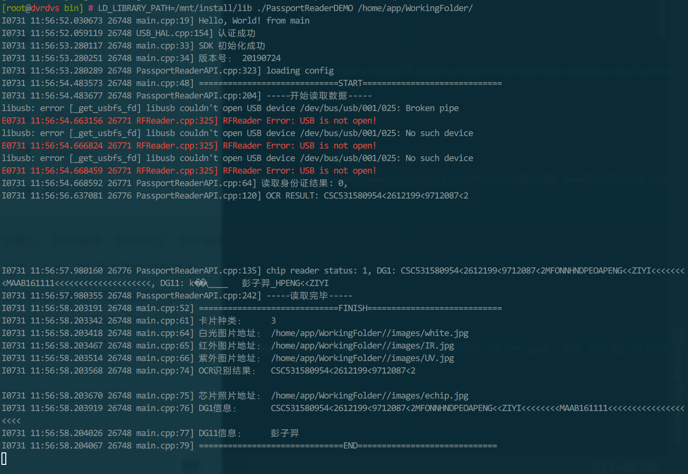

## 如何安装

1. （建议）将 ```include``` ```lib``` 目录复制到 ```/usr``` 中

2. （如果系统使用udev进行权限设置）将```rules.d```复制到```/etc/udev```中，或者使用其他方法确保应用程序对```/dev/bus/usb/```下相应设备文件具有足够的权限
3. 将sample目录拷贝至合适的位置


## 如何编译、运行Demo程序

Demo程序的源代码```sample```目录下，文件名未```demo.cpp```，预编译好的二进制文件为```demo```

手动编译指令 （如果已经进行了上一节中的操作1，无需手动指定lib和include的路径）

```shell
aarch64-unknown-linux-gnu-gcc demo.cpp -o demo \
-flto -march=armv8-a+crypto -mcpu=cortex-a57+crypto -fPIC -std=gnu++11 \
-O3 -Wall -Wextra -ffast-math -funsafe-math-optimizations -ftree-vectorize -fdata-sections -ffunction-sections \
-lPassportReaderAPI -lstdc++ -lglog \
-L/path/to/ourAPI/lib -Wl,-rpath=/path/to/ourAPI/lib/ -I/path/to/ourAPI/include
```

C Demo

```shell
aarch64-unknown-linux-gnu-gcc -o demo \
PassportReaderCAPI.cpp demo.c -flto -march=armv8-a+crypto -mcpu=cortex-a57+crypto -fPIC -std=gnu++11 \
-O3 -Wall -Wextra -ffast-math -funsafe-math-optimizations -ftree-vectorize -fdata-sections -ffunction-sections \
-lPassportReaderAPI -lstdc++ -lglog \
-L/path/to/ourAPI/lib -Wl,-rpath=/path/to/ourAPI/lib/ -I/path/to/ourAPI/include
```


运行Demo（如果已经进行了上一节中的操作1，无需添加```LD_LIBRARY_PATH```环境变量，程序参数为```WorkingFolder```目录的路径，WorkingFolder目录请直接拷贝sample目录下的模板）

```shell
LD_LIBRARY_PATH=/home/ooxx/ourAPI/lib/  ./demo WorkingFolder/
```

正常运行示例




## API函数说明

请参考```include/PassportReaderAPI.h``` 和 ```sample/demo.cpp```

